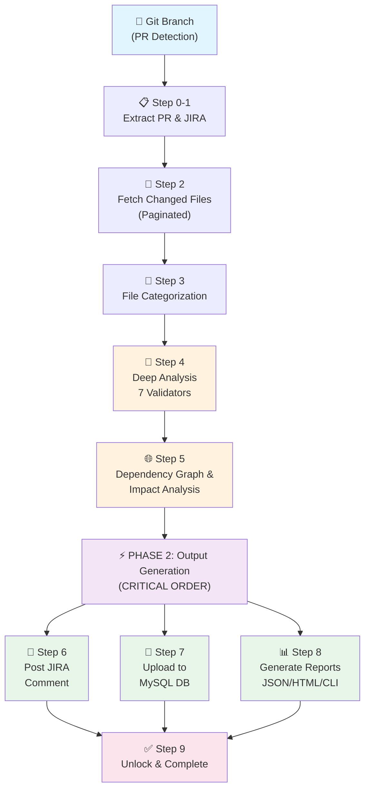
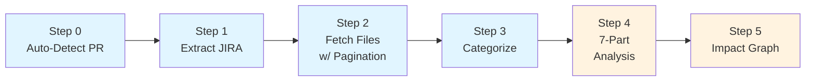
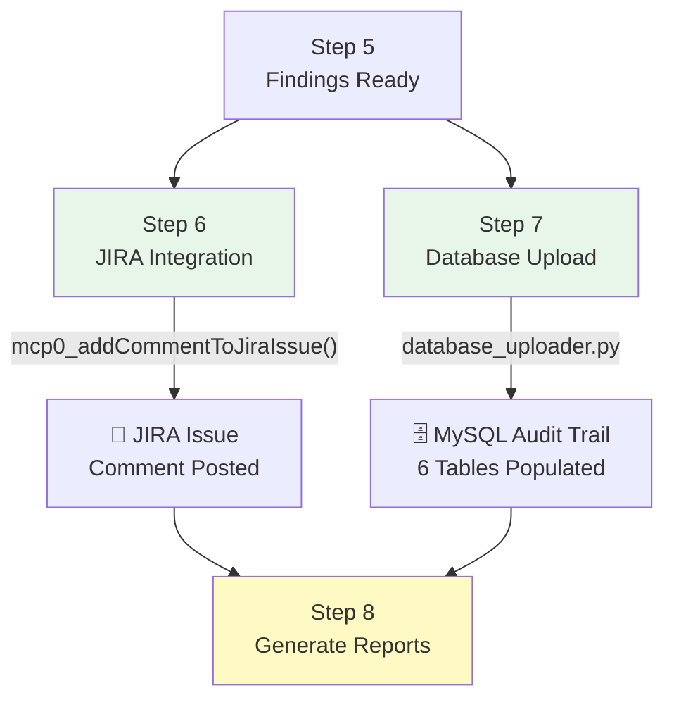
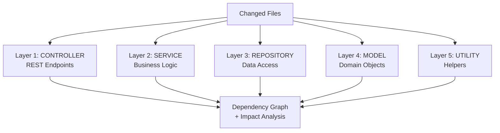
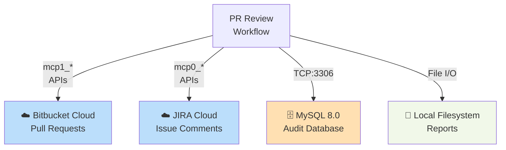

# 🔍 PR Review Comprehensive Workflow

## Executive Summary

The PR Review Comprehensive Workflow is an **automated, multi-layer pull request analysis system** that provides deep code review insights within seconds. It integrates with Bitbucket Cloud to fetch PR changes, performs intelligent code analysis across Java, XML, YAML, SQL, and configuration files, builds dependency graphs, and outputs results to JIRA (immediate feedback), MySQL (audit trail), and HTML/CLI reports (developer review).

**Key Capability**: Complete PR review automation with 10 orchestrated steps, critical execution ordering (JIRA → Database → Reports), and graceful error handling.

---

## 1. System Architecture Overview



### Execution Flow

| Phase | Steps | Purpose | Type |
|-------|-------|---------|------|
| **🔍 Analysis** | 0-5 | Extract PR metadata, fetch files, categorize, analyze code, build dependency graphs | Core |
| **⚡ Critical Outputs** | 6-7 | Post JIRA comment, upload database records | Critical (must succeed) |
| **📋 Optional Outputs** | 8 | Generate JSON/HTML/CLI reports | Non-blocking (can fail safely) |
| **🔓 Cleanup** | 9 | Unlock workflow file | Finalization |

---

## 2. Detailed Workflow Steps

### Phase 1: Analysis (Steps 0-5)



**Step 0**: Auto-detect current PR number from Git branch → Lock workflow file
**Step 1**: Retrieve PR metadata from Bitbucket API → Extract JIRA ticket ID from branch name
**Step 2**: Paginated fetch of changed files → Build complete file list (supports 10,000+ files)
**Step 3**: Categorize files (Java, XML, YAML, SQL, Properties) → Detect frameworks (Spring Boot, etc.)
**Step 4**: Run 7 parallel validators:
- Java source validation (code quality, security, performance)
- XML configuration analysis
- YAML syntax & Spring Boot properties
- SQL script safety checks
- Property file validation
- REST API endpoint impact analysis
- Test coverage assessment

**Step 5**: Build layered dependency graph (Controllers → Services → Repositories → Models → Utils) → Calculate impact propagation

### Phase 2: Critical Output Generation (Steps 6-7) ⚠️



**🔴 CRITICAL EXECUTION ORDER (WHY IT MATTERS)**

| Order | Step | System | Why First |
|-------|------|--------|-----------|
| **1️⃣ FIRST** | Step 6 | JIRA Comment | In-memory operation; immediate user feedback in issue tracker |
| **2️⃣ SECOND** | Step 7 | MySQL Database | Critical persistence; audit trail must capture analysis |
| **3️⃣ LAST** | Step 8 | Reports (JSON/HTML/CLI) | Non-blocking; can fail without breaking workflow success |

**If execution order is wrong:**
- ❌ Reports generate but fail → Entire workflow blocked
- ✅ With correct order → JIRA/DB succeed → Reports are bonus, not critical

### Phase 3: Optional Report Generation (Step 8)

- **JSON Data** (`.ai-review/pr-{N}-data.json`): Single source of truth; all finding details, impact analysis, dependencies
- **HTML Report** (`.ai-review/pr-{N}-data.html`): Interactive report with dependency graph visualization
- **CLI Output** (stdout): Terminal-friendly summary with ANSI colors for quick review

### Phase 4: Cleanup (Step 9)

Release read-only lock on workflow file → Enable re-execution for same PR

---

## 3. Key Components & Data Models

### Input Sources

| Source | API | Purpose |
|--------|-----|---------|
| **Git Branch** | `git rev-parse --abbrev-ref HEAD` | Extract PR number and JIRA ticket ID |
| **Bitbucket Cloud** | `mcp1_getPullRequest()` | PR metadata (title, author, target branch) |
| **Bitbucket Cloud** | `mcp1_getPullRequestDiffStat()` | Changed files with pagination support |
| **Bitbucket Cloud** | `mcp1_getPullRequestDiff()` | Full diffs for code analysis |

### Processing Layers



### Output Destinations

| Output | Format | Destination | Audience |
|--------|--------|-------------|----------|
| **JIRA Comment** | Markdown | JIRA Cloud issue | Development team (real-time) |
| **Database Record** | SQL rows | MySQL `pr_review_audit` | Audit trail, analytics, compliance |
| **JSON Data** | JSON structure | `.ai-review/pr-{N}-data.json` | Single source of truth |
| **HTML Report** | Interactive HTML | `.ai-review/pr-{N}-data.html` | Rich visual review |
| **CLI Summary** | ANSI text | stdout | Terminal users |

---

## 4. JSON Data Structure (Single Source of Truth)

The JSON file (`pr-{N}-data.json`) contains all analysis results and powers all report generators:

```json
{
  "metadata": {
    "pr_number": 456,
    "title": "Add new payment module",
    "author": "john.doe",
    "reviewer": "jane.smith",
    "jira_tickets": ["PROJ-123", "PROJ-124"],
    "review_date": "2024-02-18"
  },
  "summary": {
    "files_changed": 12,
    "critical_issues": 2,
    "high_issues": 5,
    "risk_level": "MEDIUM"
  },
  "findings": [
    {
      "severity": "CRITICAL",
      "type": "SECURITY",
      "title": "SQL Injection vulnerability",
      "file": "src/dao/PaymentDAO.java",
      "line": 45,
      "description": "User input not parameterized",
      "suggested_fix": "Use prepared statements"
    }
  ],
  "impact_analysis": {
    "affected_layers": ["CONTROLLER", "SERVICE", "REPOSITORY"],
    "dependency_graph": { "nodes": [...], "edges": [...] }
  }
}
```

---

## 5. External System Integrations



### Integration Details

| System | Protocol | Purpose | Auth |
|--------|----------|---------|------|
| **Bitbucket Cloud** | MCP (Claude API) | Fetch PR metadata, diffs, changed files | OAuth 2.0 (via MCP server) |
| **JIRA Cloud** | MCP (Claude API) | Post review findings as issue comments | API Token (via MCP server) |
| **MySQL Database** | TCP/3306 | Persist audit trail, findings, metrics | Username + password (env vars) |
| **Local Filesystem** | POSIX I/O | Store JSON, HTML, CLI reports | File permissions |

---

## 6. Database Schema (Audit Trail)

The `pr_review_audit` MySQL database captures complete workflow execution records:

```
pr_review_run         (1 record per PR analysis)
├─ Execution metadata, timing, author, reviewer
├─ Summary statistics (files changed, bugs found, risk level)
└─ Timing metrics (start, end, duration)

pr_review_step        (9-10 records per execution)
├─ Step number, name, status, duration
└─ Error messages if step failed

pr_review_file        (1 record per changed file)
├─ File path, layer, status
├─ Statistics (additions, deletions)
└─ AI analysis summary

pr_review_finding     (N records per analysis)
├─ Severity, type, title, location
├─ Description, impact, suggested fix
└─ Code snippet

pr_review_graph_node  (Dependency graph nodes)
├─ Node identifier, layer, file
└─ Status and relationships

pr_review_graph_edge  (Dependency relationships)
├─ Source → Target relationships
└─ Relationship type and description
```

---

## 7. Key Design Principles

### ⚡ JIRA → Database → Reports (Critical Execution Order)

**Why This Matters:**
- ✅ **JIRA First** (Step 6): Immediate feedback to team within seconds
- ✅ **Database Second** (Step 7): Persistent audit trail for compliance/analytics
- ✅ **Reports Last** (Step 8): Optional visual enhancements; non-blocking failures

**Benefit**: Workflow succeeds as long as core functionality (JIRA + DB) works. Reports are bonus.

### 🎯 Intelligent Categorization

Files automatically categorized by type → Matched with appropriate analyzers (Java validation, YAML syntax, SQL safety, etc.)

### 📊 Layered Dependency Graph

Dependency analysis respects application architecture layers:
- **Controllers** (REST endpoints) → **Services** (business logic) → **Repositories** (data access) → **Models** (domain objects) → **Utilities** (helpers)

Impact propagation calculated across layers for accurate risk assessment.

### 💾 Single Source of Truth

JSON data file serves as unified data model:
- Consumed by HTML report generator (Jinja2 template → 99.7% token savings)
- Consumed by CLI formatter (ANSI-colored terminal output)
- Consumed by database uploader (structured record insertion)

### 🔒 Graceful Degradation

- Critical failures block workflow (JIRA, Database)
- Secondary failures logged but don't block (HTML, CLI generation)
- Always produces some output even if downstream formatters fail

### 📈 Scalability

- Paginated API calls support 10,000+ changed files
- Parallel analysis validators (Java, XML, YAML, SQL, properties simultaneously)
- Optimized JSON serialization with direct file writing (15-25% faster)

---

## 8. Workflow Lock Mechanism

```
EXECUTION START → Lock workflow file (read-only)
                  ↓
              [Steps 0-9 execute]
                  ↓
EXECUTION END   → Unlock workflow file (writable)
```

- **Purpose**: Prevent accidental workflow modifications during execution
- **Re-execution**: Same PR can be analyzed unlimited times (overwrite mode)
- **Lock Duration**: Only during workflow execution (typically < 5 minutes)

---

## 9. Quick Reference: File Locations

| Component | Path |
|-----------|------|
| **Workflow Definition** | `.windsurf/workflows/pr-review-comprehensive.md` (2706 lines) |
| **Python Templates** | `.windsurf/workflows/templates/` (26 files) |
| **Orchestration** | `.windsurf/workflows/templates/execution_orchestrator.py` |
| **Database Schema** | `.windsurf/workflows/templates/pr_review_audit_schema.sql` |
| **Reports Output** | `.ai-review/pr-{N}-data.json`, `.ai-review/pr-{N}-data.html` |
| **Lock File** | `.ai-review/workflow.lock` |

---

## 10. Architecture Benefits

| Benefit | How Achieved |
|---------|--------------|
| **Enterprise-Grade** | Structured multi-phase execution, audit trail, error handling |
| **Real-Time Feedback** | JIRA comment posted within seconds of analysis complete |
| **Non-Blocking** | Critical functions (JIRA, DB) succeed → optional reports can fail safely |
| **Audit Trail** | Complete execution history in MySQL with detailed metrics |
| **Token Efficient** | 99.7% reduction via externalized Jinja2 template (HTML generation) |
| **Scalable** | Handles 10,000+ file changes with paginated API calls |
| **Developer Friendly** | Multiple output formats (JIRA, JSON, HTML, CLI) for different use cases |
| **Error Resilient** | Graceful degradation; workflow doesn't break if optional components fail |

---

**Technical Team**: For deep implementation details, refer to `.windsurf/workflows/pr-review-comprehensive.md` (comprehensive workflow definition) and individual Python templates in `.windsurf/workflows/templates/`.

**Last Updated**: February 2024 | **Status**: Production Ready | **Branch**: `claude/stabilize-workflow-output-0Rb96`